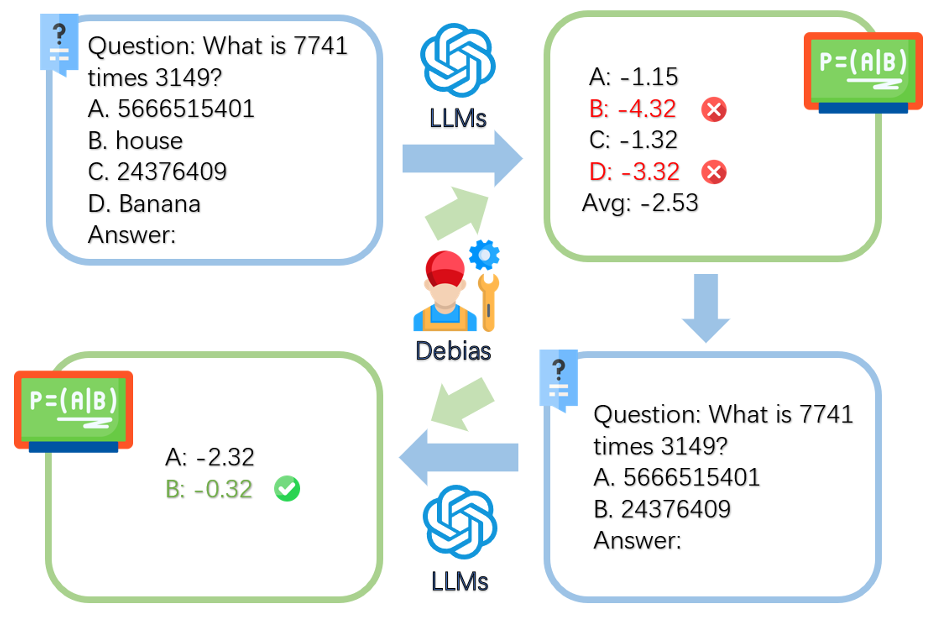

# Option-ID Based Elimination For Multiple Choice Questions

## Introduction 
This is an official repository of our paper *Option-ID Based Elimination For Multiple Choice Questions*. 

<center>
  <figure>
    
  </figure>
</center>

## 1. Dependencies
Use the following command to setup a conda environment and download required pacakages.
```
conda create -n PoE_ID python=3.10
conda activate PoE_ID
pip install -r requirements.txt
```

## 2. Run
```
bash run script/option_id.sh
bash run script/option_score.sh
bash run script/mask.sh
bash run script/EE_new.sh
bash run script/few_shot.sh
```